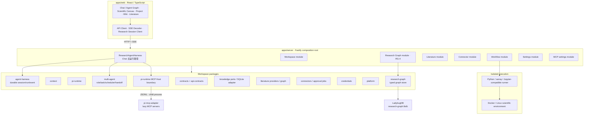
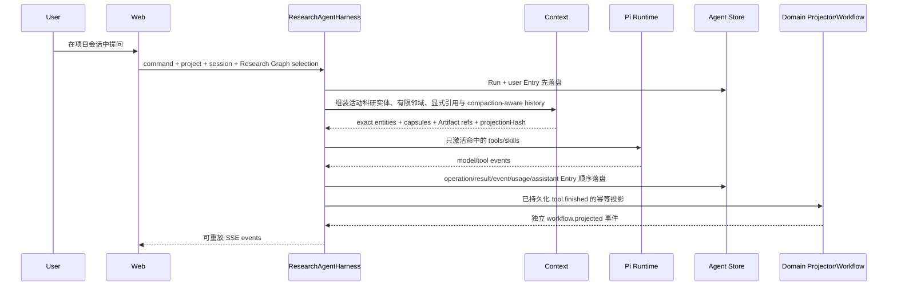

# 汐灵 OS 设计文档

> 本文档是汐灵 OS 当前产品与软件架构的首要入口（living design document）。
>
> - 状态：有效
> - 最后核对：2026-08-31
> - 对应版本：Research OS Modernization R0–R7 本地实现；通用执行内核、内容寻址 Artifact、隔离多智能体、上下文质量观测和第二科学领域已接入
> - 代码事实源：`packages/contracts`、`packages/api-contracts` 与各模块的公开接口
> - 架构宪法：[科研内核架构宪法](docs/architecture/research-os-constitution.md)
> - 端到端验收：[黄金科研任务与质量基线](docs/quality/golden-research-tasks.md)

## 如何阅读与维护本文

本文只描述**当前有效设计**，不是路线图或开发日志。代码公开接口与自动化测试描述实际行为；本文负责解释系统级所有权、不变量和运行流程；ADR 记录选择原因；`docs/gate-*` 与 `docs/spikes/` 仅供历史追溯。完整入口见[文档导航](docs/README.md)。

若文档相互冲突，按“代码公开接口与测试 → 本文 → 未被替代的 ADR → 专题架构文档 → 历史 Gate/Spike”处理。发现实现偏离本文时，应先判断是实现回归还是已批准的设计变化：前者修代码，后者在同一变更中更新本文与 ADR。

本文中的“已实现”表示存在正式主路径和自动化验证；“发布就绪”还要求真实平台、容器、凭据和科研项目验收。二者不得混用。

## 1. 产品目标

汐灵 OS 的产品定位是面向广泛科学领域的本地优先人工智能科研操作系统。当前交付形态优先服务个人研究者，海洋与气候是目前完成度最高的官方领域模块，但产品边界、核心对象和 Agent 架构不得以该学科为中心。系统要把以下过程组织成一个可审批、可追踪、可恢复的研究闭环：

```text
科研问题 → 文献证据 → 数据检索/切片 → 隔离计算 → 图表与报告
        → Reviewer 审查 → Artifact/溯源 → 项目、画布与 Wiki 沉淀
```

稳定内核直接面向通用科研问题；学科特有的数据源、校验规则、方法、查看器与执行环境通过受审计领域模块接入。现阶段优先补齐 Python 海洋与气候研究闭环，不代表产品被定义为海洋科研软件。汐灵不以通用办公 Agent、团队协作平台或云端多租户系统为目标。

产品的五个主要工作面不是五套独立数据：

| 工作面 | 主要职责 | 共享对象 |
|---|---|---|
| Chat | 提问、分解任务、工具调用、审批入口；在“对话 / Agent 运行图”之间切换 | Project、AgentSession、AgentRun、AgentEntry |
| 科研画布 | 从总览或文献、证据、溯源、Artifact 分项视图理解项目科研事实 | ResearchGraph、Claim、EvidenceAssertion、Run、ArtifactVersion |
| 项目 | 目标、事项、实验与科研闭环状态 | Project、ProjectItem、Workflow |
| Wiki | 像浏览百科一样理解项目并定位结论和产物 | WikiPage、Evidence、Artifact、ProjectItem |
| 文献工作台 | 搜索关系、发现论文、阅读和标注；将选中内容提升为项目证据 | DiscoveryGraph、Paper、Annotation |

### 当前交付边界

| 范围 | 当前状态 | 不应误解为 |
|---|---|---|
| 通用科研内核 | Agent Harness、Research Graph、Artifact、Execution、Context 和领域组合已进入正式主路径 | 已自动覆盖所有科学学科 |
| 领域模块 | 海洋/气候工作流与连接器最完整；表格实验领域已接入通用执行链 | 所有学科连接器、查看器和实验设备均已支持 |
| 模型调用 | 正式调用使用用户配置的真实 Provider/模型，支持角色级路由 | 系统自带免费模型或保证第三方可用性 |
| 科学执行 | 统一 Docker Linux Runner，审批和内容哈希进入执行记录 | 所有 Pi/MCP 工具都已获得 OS 级沙箱 |
| 跨平台 | macOS、Linux、Windows 11 原生控制面；Windows 科研执行使用 Docker Desktop | 已完成签名安装包和全部真实 Windows 场景验收 |
| 外部知识工具 | 数据模型可投影为 Markdown/JSON Canvas | 当前已提供 Obsidian 双向同步 |

## 2. 设计原则

1. **本地优先**：项目元数据和凭据默认保存在本机；科研执行进入受控容器。
2. **开源优先**：先复用成熟库、协议和格式，自研模块必须有稳定替换边界和 smoke。
3. **审批优先**：下载、计算和外部写入必须先形成可读计划并等待用户确认。
4. **证据优先**：摘要和模型输出不是证据；结论必须回链到论文、数据或 Artifact。
5. **天然节省上下文**：依靠上下文拓扑、按需能力、内容寻址、缓存和结构化交接减少重复，而不是为正常科研任务强行设置统一 token 上限。
6. **模块化单体**：在确有独立扩缩容或故障隔离需求前，不用微服务增加本地安装成本。
7. **跨平台边界清晰**：macOS、Linux、Windows 11 原生运行控制面；不可信科研执行统一进入 Docker Linux 沙箱。

任何新增能力都必须同时回答四个问题：谁拥有事实、写入经过什么授权、失败后如何恢复、进入模型时如何有界。页面存在、接口返回成功或模型能够生成文本，都不能替代这四项设计。

## 3. 总体架构



部署细节见 [三平台部署设计](docs/architecture/deployment.md)，模块边界的完整说明见 [模块化单体架构](docs/architecture/modular-monolith.md)。

正式 Chat 使用 `/api/agent-center/*`：Server 先建立耐久 Run 与用户 Entry，再执行 Pi Runtime，并以可续传事件流暴露进度。RG-1 已把 Agent Execution Graph 放入 Chat，并从同一 Agent Store 只读投影；新的顶层科研画布只投影 Research Graph。详见 [ADR 0026](docs/adr/0026-agent-execution-graph-in-chat.md)、[Agent 中枢架构纠偏 Gate](docs/gate-4.5-agent-center-correction.md) 和 [Research Graph 架构](docs/architecture/research-graph.md)。

### 3.1 信任与进程边界

| 边界 | 可信职责 | 不得承担 |
|---|---|---|
| Browser/Web | 发命令、展示快照和事件、保存纯界面偏好 | Agent/Workflow/Claim 写入真相、持有明文凭据 |
| Native Server | 校验契约、编排审批、持久化控制面、装配最小上下文 | 直接执行模型生成的科研代码 |
| Pi Runtime Host | 模型与工具循环、Skill/MCP 惰性适配、取消和压缩原语 | 拥有科研事实或绕过领域审批 |
| Docker Runner | 执行已批准的科学 Spec、生成受管输出 | 访问未声明 Host 路径、无限网络或长期持有凭据 |
| External Provider | 只接收当前请求所需的最小内容 | 获得整个项目数据库、凭据库或完整 Artifact Store |

Docker 沙箱当前覆盖科学 Runner；MCP 使用隔离子进程、固定代理和审批边界，但不能宣传为与 Runner 等价的通用 OS 沙箱。

## 4. 仓库结构与所有权

```text
apps/
├── web/                         # UI、视图状态、HTTP/SSE 客户端
└── server/                      # 组合根、模块路由、应用级编排
    └── src/modules/
        ├── research-graph/      # 科研图查询与独立 Scientific Canvas Layout Store
        ├── connectors/          # 元数据、审批任务、下载与 Artifact API
        ├── literature/          # 文献搜索、真实摘要、阅读标注与结构化证据提升
        ├── workflows/           # 项目科研闭环 HTTP API
        ├── workspace/           # Project、事项、Chat 历史、Wiki
        ├── settings/            # 凭据状态、模型路由、自定义 Provider
        ├── mcp/                 # MCP 配置、密钥状态、连通性测试
        ├── agent-center/        # 正式 command/snapshot/event/source API
        ├── artifacts/           # 内容寻址 Artifact API
        ├── attention/           # 审批、失败、证据缺口与提案聚合
        └── tabular/             # 第二领域的通用 Execution 纵向切片
packages/
├── contracts/                   # 领域中立的 TypeScript 核心类型
├── api-contracts/               # 前后端共享 Zod 运行时契约
├── artifacts/                   # SHA-256 blob + 项目隔离元数据 Registry
├── execution/                   # 计划、审批、物化、幂等与 Runner port
├── context/                     # 投影、Capsule、组装、缓存与 token 估算
├── pi-runtime/                  # Pi SDK 适配、模型路由、Skill、MCP Host、TokenLedger
├── agent-harness/               # Pi 无关的耐久 Agent 运行中枢
├── multi-agent/                 # Pi 无关的角色、TaskPacket、调度与 Handoff
├── science-domains/             # 科学领域 Manifest、注册与项目级组合
├── domain-ocean/                # 当前优先完成的海洋/气候领域模块
├── domain-tabular/              # 表格实验领域模块、导入器与 Recipe
├── research-graph/              # 科研实体、关系 Schema、LadybugDB 适配器
├── knowledge/                   # Knowledge ports、SQLite 适配与迁移
├── literature/                  # 文献 Provider、缓存和图算法
├── connectors/                  # 数据连接器契约、预检、审批状态机
├── credentials/                 # 加密凭据存储
└── platform/                    # Windows 原生路径与导入适配
services/runner/                 # Python 科学计算与容器执行
scripts/                         # smoke、架构、合规和跨平台检查
docs/adr/                        # 已接受或被替代的架构决策
```

### 4.1 依赖方向

- `contracts` 不依赖其他领域包。
- `api-contracts` 只依赖 `contracts` 和运行时校验库。
- 领域包不得依赖 `apps/*`。
- Web 不得导入 Server 实现。
- Server 是组合根，可以装配领域包；模块之间优先依赖 port/interface。
- 新依赖必须通过 `pnpm architecture`。

依赖方向由 `scripts/architecture-check.mjs` 自动检查。不能仅为了让检查通过而扩大允许列表；改变方向必须先写 ADR。

## 5. 核心领域对象与数据所有权

`packages/contracts/src/index.ts` 是领域中立核心类型事实源；学科类型由对应 `domain-*` 包拥有。本文只记录所有权，不复制完整接口。

| 对象 | 当前所有者 | 持久化 | 关键约束 |
|---|---|---|---|
| Project / ProjectItem | Knowledge | SQLite | 所有研究对象必须属于 Project |
| ScienceDomainManifest | Science Domains | 代码清单 + 项目 domainIds | 通用科研内核始终启用；领域清单不自动获得执行权限 |
| ChatSession 目录 | Knowledge | SQLite | 会话必须项目隔离 |
| Agent Entry / Message | Agent Harness | Agent SQLite | Server 单写；Chat 与运行图按稳定 source ID 查询 |
| WikiPage / Revision | Knowledge | SQLite | Revision 不可变；恢复产生新版本；全文搜索使用带 ESCAPE 的 LIKE（FTS5 索引因 CJK 分词与只写不读已于 2026-08-31 移除） |
| Evidence 捕获记录 | Knowledge | SQLite + outbox | 每条证据保存原文摘录、定位、解释、局限、立场、置信度与目标 ClaimRevision；同一论文可支持多个断言 |
| ResearchGraphProposal | Research Graph module | 独立 SQLite | Agent/用户的 Claim 新建或修订先落待审提案；接受后才生成不可变 ClaimRevision，拒绝不改科研事实 |
| ContextCapsule | Context + Knowledge | SQLite 派生缓存 | 不是证据源；源变化后失效 |
| Agent Execution Graph | Agent Harness | Agent SQLite | 当前链与项目全量运行图都是执行事实的查询投影 |
| ResearchGraphEntity / Relation | Research Graph | LadybugDB | 类型化科研事实、单写事务、项目隔离、稳定内容哈希 |
| Scientific Canvas Layout | Research Graph module | 独立 SQLite | `project + view` 隔离、revision 防覆盖；坐标/视口不是科研事实，不写图数据库 |
| Paper / DiscoveryGraph | Literature | Provider cache | 搜索结果是临时图；收藏、标注或提升证据后才进入 Research Graph |
| ConnectorJob | Connectors | JSON repository | 未审批不得下载；计划与来源哈希绑定 |
| ProjectResearchWorkflow | Workflow | 独立 SQLite + outbox | 新科研闭环的唯一状态机；状态和投影事件同事务 |
| Artifact payload / RO-Crate | Artifact Registry | SHA-256 blob + SQLite metadata | 正式 URI 为 `artifact://sha256/*`；大 payload 不进入数据库或模型上下文 |
| ExecutionPlan / Receipt / Record | Execution | SQLite + Runner port | 审批绑定代码、参数、环境、资源、网络和输入选择；幂等键不得指向不同规范 |
| Credential | Credentials | 加密文件 | 密钥不回传 UI、不进入日志/上下文 |
| TokenLedger | Pi Runtime | JSONL | 用于观测，不作为正常任务硬限额 |
| McpServerSettings | MCP Settings + Credentials | JSON + 加密凭据文件 | Server 配置不含密钥；完整工具目录留在隔离 Host |
| AgentSession / Run / Operation / Entry / Usage / Compaction | Agent Harness | 独立 SQLite | Gate 4.5-D 已成为 Chat 与 Agent Execution Graph 主事实源 |
| AgentDelegation / TaskResult | Multi-Agent + Agent Harness | Agent SQLite | 独立 child session；父子血缘、上下文哈希、预算和结果耐久化；禁止递归 |

业务数据库不持久化任意操作系统绝对路径。跨平台资源使用 `project://`、`artifact://`、`dataset://` URI。

### 5.1 标识、版本与引用规则

- Project 内对象使用稳定 ID；跨存储引用必须携带对象类型和稳定 URI/ID，不复制显示文本作为关联键。
- 可审计科研对象采用不可变版本：ClaimRevision、WikiRevision、DatasetSnapshot、ArtifactVersion 通过 `SUPERSEDES` 或明确父版本连接。
- 内容寻址只证明字节一致，不等于科学有效；Evidence、Review、Approval 和 Provenance 分别记录语义判断与责任链。
- 列表缓存、ContextCapsule、DiscoveryGraph 和 Canvas Layout 都是可重建投影，不得成为正式结论的唯一来源。
- 外部文件导入先生成受管快照与哈希；原始路径仅作为审计/显示元数据。

## 6. 关键运行流程

### 6.1 Chat 与上下文

以下时序描述当前正式链路。Web 只发命令、订阅事件并刷新领域投影，不拥有 Agent 或 Workflow 写入事实。



重要约束：

- 默认只读取当前活动科研实体、确定性的两跳有限邻域和显式引用；Research Graph 的循环关系不会被当成对话树。
- 整张科研图、其他项目和 Agent Execution Graph 不会因为“页面可见”而自动进入上下文。
- Skill 常驻部分只有索引；正文只在命中时装载。
- 工具 schema 只为本轮相关能力激活。
- PDF、NetCDF、完整日志和图像 payload 只以 Artifact URI 流动。
- Context Assembler 根据模型窗口做可解释的语义降级；不得静默截断证据。
- Agent Store 保存 Run、Operation、Entry、Usage、Compaction 和事件游标；重连按序号重放。
- 自动 Compaction 保留覆盖范围、来源哈希和 retained tail；原 Entry 不删除。
- MCP 只在宿主元数据命中任务后增加一个固定代理工具；Server 与具体工具 schema 不进入 Agent 主上下文。
- 多智能体委派工具同样按任务意图惰性激活；每个子任务只获得 ContextManifest 对应的科研图切片和角色 capability allowlist，不继承父会话全文。

当前不变量：

- `ResearchAgentHarness` 是 Agent loop、会话条目、工具调用、压缩检查点和取消状态的唯一协调入口。
- Durable Agent Session Store 是 Agent 历史真相源；Web 端只发命令、订阅事件和保存纯展示偏好。
- Project/Wiki/Evidence、Research Graph、Layout 与 Artifact 由各自仓储拥有，Agent 只通过显式 projector 写入领域对象。
- 科研画布只显示 Research Graph 的摘要与 URI，不复制 Agent 原文；需要旧对话时走压缩索引与耐久 Entry 回读。
- `SourceContentResolver` 只在投影命中后按 source kind 解析 Agent Entry、Evidence 原文、Provider 摘要、Wiki Revision、Workflow 或受管 Artifact；每段上下文显式标记“原文/摘要/解释”，禁止把节点展示摘要伪装成来源原文。
- Scientific Canvas、Agent Execution Graph 与 Pi Session Tree 不做 1:1 映射；移动和布局不改变科研事实或追加式执行事实。
- Agent 生成的 Wiki 草稿必须携带 source/run/evidence 溯源，发布继续经过用户确认。
- Research Director 负责最终综合；仅预置 Research Explorer、Domain Executor、Independent Reviewer 三个基础角色，并按任务只暴露命中角色。证据、复现、方法与反方差异使用动态审查 rubric，结果进入 Research Graph 前仍走 proposal/approval。

详细机制见 [上下文经济架构](docs/architecture/context-budget.md)和[多智能体科研编排](docs/architecture/multi-agent.md)。MCP 已通过独立 Host 接入：无配置时不启动子进程，任务未命中时不激活代理工具，具体工具 schema 由 adapter 缓存并按 search/describe 获取。

### 6.2 项目科研闭环

当前唯一主状态机是 `ProjectWorkflowService`：

```text
draft → probing → pending_approval → approved
      → downloading → analyzing → completed
```

并支持 `rejected`、`failed`、`cancelled` 和显式 `reset`。

1. Agent 只能生成经过 schema 验证的数据切片计划。
2. 元数据探测返回变量、范围、预计体积和目标，不执行下载。
3. 用户批准当前哈希对应的计划。
4. Connector 下载受批准的数据，Runner 在隔离容器中分析。
5. Reviewer 检查结果与限制，Runner 生成 Artifact 和 RO-Crate。
6. Workflow SQLite 在状态事务中写 outbox；幂等 projector 将计划、审批、数据快照、Run、Artifact、Reviewer 与生命周期投影到 Research Graph，再标记 Workflow 已沉淀。

旧 Gate 3 路由、聚合包与演示界面已经删除；正式科研闭环只经 Project Workflow、Research Graph 与 Artifact Viewer。

跨领域计算语义由 `@xiling/execution` 统一：Plan 在审批前固定代码快照、参数、随机种子、环境、资源和网络；输入物化后形成带内容哈希的 Spec；Coordinator 校验 Approval Receipt、幂等收据、超时和取消。海洋 Workflow 是现有领域适配器，表格实验纵向切片已经直接使用通用 ExecutionCoordinator；新增领域不得复制执行协调器。

### 6.3 两种画布与三类图

系统不再让一个 Canvas 同时承担 Agent 运行监控和科研事实存储：

- **Agent Execution Graph** 属于 Chat。图模式默认展示当前 Session 的低密度对话投影：每轮只呈现研究指令与关键回答，Model、Tool、Tool Result、Usage 与 Compaction 折叠在回答节点的按需详情中；项目全景是次级切换。节点可按“沿节点继续”或“组合引用”进入同一 Composer，完整事实仍来自 Agent Store，拖动只改变当前视图。RG-2 已用稳定 `agent-run://` 与 Artifact URI 在 Research Graph 建立来源引用。
- **Scientific Canvas** 是 Research Graph 的可视化投影。它支持项目总览以及 `literature`、`evidence`、`provenance`、`artifacts` 分项视图。
- **Literature Discovery Graph** 只存在于文献工作台，用于搜索和推荐。临时论文不能因出现在搜索图中就成为项目证据。

RG-1 撤下旧顶层 Agent Canvas 并删除 Chat 写入；RG-2 删除 Workflow settlement；RG-3 把 Chat context 切换为 Research Graph 局部投影；RG-4 删除旧 Canvas 的 Web、HTTP 与文件仓储。文献证据只通过 Knowledge outbox 投影到 Research Graph。

Scientific Canvas 的节点位置、折叠、视口和自动布局属于 Layout Store。科研关系属于 Research Graph；Agent 只能生成待确认的 `ResearchGraphChangeSet`，用户确认后在单一图事务中写入。布局变更可直接执行。

### 6.4 Wiki

Wiki 的目的不是独立笔记编辑器，而是项目的百科入口：用户应能从项目概述逐层定位研究问题、方法、数据、证据、实验、结论、限制、图表、工具和 Artifact。

- 页面属于 Project，正文使用 Markdown。
- 修订不可变，恢复旧版本会创建新 revision。
- `[[slug]]` 建立站内链接和反向链接。
- Artifact 只嵌入 URI/查看器，不复制二进制内容。
- Agent 默认产生草稿或差异，不应直接覆盖用户正式内容。

### 6.5 外部知识工具投影

Wiki Markdown、`[[slug]]`、Research Graph 实体/关系和 Artifact URI 可以投影为文件式知识库。面向 Obsidian 等工具的设计边界是：

- 导出 Markdown 页面、附件清单和 JSON Canvas；导出物可删除重建，不反向成为唯一事实源。
- 类型化 Research Graph 关系可以进入 Canvas edge label 或 note frontmatter；普通反向链接图会损失关系类型，不能代替 Research Graph。
- Artifact 必须物化为受管附件或只读链接，并保存内容哈希与来源 URI。
- 外部编辑若要回流，只能生成 Wiki Revision 或 ResearchGraphProposal，不能原地覆盖 Claim、Evidence、Run 或 Provenance。

当前代码尚未交付该导入/导出适配器，因此 UI 和文档不得宣称已与 Obsidian 双向兼容。

## 7. API 与前端基础设施

- 应用壳采用“侧边导航 + 当前工作区”两栏；侧栏位置顺序遵循 `27ebdf7` 的稳定布局，但视觉与组件只以当前设计系统为准。设置入口固定在侧栏左下角；设置页独占全宽并使用“常规—智能体—连接—系统”的局部导航。主题只在“常规 → 外观与主题”中显式选择，工作区侧栏不提供循环切换快捷键。
- 文献工作台、项目管理和 Wiki 是经用户确认的视觉兼容例外：视图源码与隔离样式锁定 `27ebdf7`，只通过当前应用壳继续访问最新版后端。兼容层不得扩散到 Chat、科研画布、设置页或全局令牌；详见 ADR 0042。
- Chat 的运行图和 Artifact Viewer 是会话上下文的一部分：运行图在 Chat 内切换，Artifact 在 Chat 内按需停靠、调宽、抽屉或全屏。禁止恢复应用级常驻 `OutputPanel`，避免与 Chat 自有面板形成双重第三栏。
- HTTP 输入由 `@xiling/api-contracts` 校验；修改请求字段时前后端必须在同一变更中升级。
- `apps/web/src/lib/api-client.ts` 是 JSON 请求和 API 错误的统一入口。
- `apps/web/src/lib/agent-stream.ts` 是 SSE 解码的统一入口。
- `apps/web/src/lib/research-session-client.ts` 只负责发送 Agent command、订阅耐久事件和触发取消；消息、Run 与工具→Workflow 投影均由 Server 拥有。
- 视图组件不得重新实现 fetch、SSE parser 或 Workflow 协议。
- 禁止向 `research-session-client.ts` 增加 Agent 持久化或领域写入职责。
- 当前旧路由的错误 body 尚未完全统一；新增 API 应返回 `{ error, code?, details? }`，后续会以兼容方式统一旧接口。

## 8. 模型、Skill 与 MCP

### 模型

- 用户可输入任意模型 ID；推荐目录只是便利选项，不是白名单。
- 原生输入/输出模态属于模型，而不是 Provider。
- 模型不支持某模态时，界面直接禁用；不得用非原生转换伪装支持。
- 自定义 Provider 当前支持显式 Base URL 和 API 风格边界。
- 连通性测试只发送最小测试请求，不把项目数据带出系统。

### Skill

- `skills/` 中的目录由宿主索引。
- 初始上下文只包含名称、描述、版本和 capability IDs。
- 任务命中后才读取正文，并只激活关联工具。
- 设置页通过 `/api/settings/skills` 可视化已安装目录、触发词和 Capability→工具映射；接口不返回相对路径或 `SKILL.md` 正文，打开设置不会触发 Skill 加载。
- 当前 Skill 目录由仓库 `skills/catalog.json` 管理；设置页提供只读检查和刷新，不伪装尚未实现的安装、禁用或版本升级操作。
- Pi Package 将按资源分级兼容：Skill/Prompt 可审计导入，Tool Extension 必须经受限 API 与隔离执行，TUI/Theme/Coding Command 不兼容；当前尚未实现安装器。
- Pi 升级只允许通过 `@xiling/pi-runtime` 适配边界，core/ai 同版本精确锁定并运行 `pnpm pi:compat`。

### MCP

- 设置页管理 HTTP/stdio Server、用途关键词、none/Bearer/OAuth 鉴权、启停、信任级别与连通性测试。
- Bearer Token 进入 AES-256-GCM 凭据库；JSON 配置和浏览器 API 只保存/返回配置状态。
- `pi-mcp-adapter` 与 `pi-coding-agent` 只运行在 `@xiling/pi-runtime` 管理的独立子进程；Server 通过 JSONL port 调用，不加载任意 Extension。
- Host 不扫描 Cursor、Claude、Codex 或用户 Pi 配置；外部 stdio 进程使用 `shell: false`，Windows 由原生受控 Host 执行。
- Agent 常规轮次没有 MCP schema。任务命中 Server 名称、用途或关键词后，只激活一个固定 `mcp` 代理工具；具体 schema 通过 search/describe 按需读取。
- 默认只允许发现和测试；实际工具调用由 adapter 硬性要求审批。用户显式信任某个 Server 才解除该拦截。
- 输出有字节、行数和 details 上限；长结果应进入 Artifact。Host 失败不会阻断没有使用 MCP 的 Chat、Canvas、Wiki 或项目功能。

当前已知边界：通用 Pi Package 安装器仍未实现；OAuth 授权动作由 adapter 按需处理；trusted 是用户对单个 Server 的显式高权限选择，不等同于取消汐灵对下载、计算和外部写入的领域审批规则。

## 9. 安全与执行边界

- 服务默认只绑定 `127.0.0.1`；Host 头必须是本机回环地址（防 DNS rebinding），且所有非 GET 控制面请求必须携带启动时生成本地访问令牌文件（`runtime/access-token`，0600）对应的 `x-xiling-token` 头，浏览器通过 `GET /api/auth/token` 获取——跨源页面既读不到令牌也无法伪造请求头。
- 科研代码和官方客户端通过 `@xiling/execution` 的统一策略，在非 root、移除 capabilities、禁止提权且限制 CPU/内存/PID/IPC/tmpfs 的 Linux 容器中运行。
- 凭据通过受控通道注入单次运行，不进入 argv、Artifact、计划 JSON 或模型上下文。
- MCP Bearer Token 只在隔离 Host 配置时读取，不回传 Web；默认 Server 工具调用需审批。
- 下载审批锁定请求哈希、元数据来源哈希、变量、区域、时间、深度、体积和目标；批准的体积估算以 `--max-bytes` 传入 Runner 并在实际下载后对账，超出即失败。
- 通用执行审批锁定代码快照、参数、随机种子、环境 digest、资源和网络策略；输入物化后记录内容哈希。下载/探测/分析均有墙钟超时（分别默认 30/2/15 分钟），镜像在运行时钉定为不可变 image ID。
- 取消使用应用 cancellation token、Pi `abort()`、Jupyter interrupt 或 Docker stop/kill 升级路径，不依赖 POSIX 信号语义。
- 受管 Artifact 读取必须校验 URI、扩展名、路径穿越和最大读取量。

## 10. Windows 兼容策略

- 正式支持 Windows 11 x86_64 原生控制面：Node、Web、SQLite、LadybugDB、项目和 Artifact 位于 `%LOCALAPPDATA%\XiLingOS`。
- Python、官方数据客户端和模型生成科研代码只在 Docker Desktop Linux 沙箱运行；汐灵不安装或调用 WSL。
- NTFS/OneDrive 文件先预检并复制为内容寻址项目快照；任意 Host 路径不得直接暴露给科研容器。
- PowerShell 负责 Doctor、安装、启动、停止和路径导入；跨平台 Node 启动器在 `/health` 通过后打开浏览器。
- 文本统一 UTF-8/LF；Shell 与 PowerShell 分别有入口，`windows-latest` 是合并测试矩阵的一部分。
- Windows 11 + Docker Desktop 的完整发布验证仍须在真实专机执行；hosted CI 不能替代安装、休眠、代理与大文件验收。

## 11. 持久化、一致性与恢复

### SQLite

- `KnowledgeService` 是当前 SQLite 适配器，调用方依赖 `ProjectStore`、`ConversationStore`、`WikiStore` 等窄 ports。
- schema 由顺序 migration 管理，版本保存在 `PRAGMA user_version`（当前 v9）。
- 应用拒绝打开高于自身支持版本的数据库。
- 新表或字段必须新增 migration，禁止修改已经发布的 migration。

### 图与布局

- 旧 Canvas JSON、HTTP 模块、Web 组件和文献固定入口已全部删除，开发期不迁移。
- Agent Execution Graph 坐标不持久化，语义始终从 Agent Store 重建；项目/当前 Session 查询是有界只读投影。
- Scientific Canvas Layout 使用独立 `scientific-canvas-layout.sqlite` 和 revision；布局按项目与五种视图隔离，Research Graph 不保存坐标。

### Research Graph

- `research-graph.lbdb` 保存项目科研实体、类型化关系和 applied ledger，当前 Schema 版本为 2。
- Server 持有唯一可写 Ladybug Database，写入通过单写队列和 ChangeSet 事务。
- 关系端点必须存在于同一 Project；失败时整个 ChangeSet 回滚。
- 已接受的 ClaimRevision、DatasetSnapshot、ArtifactVersion 和 WikiRevisionRef 不原地覆盖；新版本通过 `SUPERSEDES` 连接。
- EvidenceAssertion 显式保存 `supports/refutes/qualifies/insufficient`、原文摘录、来源定位、解释、局限、置信度和目标 ClaimRevision；不得把模型摘要当作 EvidenceAssertion 来源。
- Claim/ClaimRevision 写入必须经过 `ResearchGraphProposal` 的接受决策；修订生成新版本和 `SUPERSEDES`，不得原地覆写。
- WAL、Checkpoint、非优雅退出恢复由离线 smoke 验证。备份必须先停写、Checkpoint、关闭，再复制数据库文件。

### 跨存储投影与 reconcile

Agent SQLite、Knowledge SQLite、Workflow SQLite、Scientific Canvas Layout SQLite 与 Research Graph 不共享事务。Knowledge/Workflow 在源状态同一事务中写 durable outbox，Agent 复用耐久事件日志，Research Graph 在科研变更同一事务中写 applied ledger，启动及查询前 reconcile。布局是可覆盖的纯表现状态，使用自身 revision，不参与科研投影事务。

### Agent 会话

`agent-center.sqlite` 是追加式 Agent 执行事实源；Knowledge 只拥有 Chat Session 目录及其 Research Graph selection（数据库兼容字段名仍为 `canvasContext`），不保存消息副本或读取回退。归档会话可读不可写，服务关闭会等待在途 Harness 执行完成后再关闭数据库。

## 12. 如何扩展系统

### 新增领域功能

1. 明确对象所有者和持久化位置。
2. 在领域包定义 port/type，不从另一个模块导入实现。
3. HTTP schema 放入 `api-contracts`。
4. Server 模块只注册路由和适配器；跨模块流程留在组合/应用层。
5. Web 通过共享客户端调用，不在视图复制协议。
6. 增加最短成功路径、关键失败路径、重启/取消或并发测试。
7. 若改变本文的不变量，先新增 ADR，再修改代码和本文。

### 新增科学领域包

1. 先复用 `general-science` 的证据、溯源、文献、Artifact、复现和审查对象，不复制科研内核。
2. 在 `ScienceDomainManifest` 声明提示片段、能力元数据、角色、连接器、Artifact 类型和 schema namespace。
3. 在 `apps/server/src/installed-domains.ts` 注册安装项；有副作用的工具必须显式注册 adapter，并沿用审批与 capability token；Manifest 不能携带任意执行代码。
4. 领域依赖进入独立 Runner 环境，不进入 Agent 核心或 Node Server 常驻上下文。
5. 未选择该领域的项目不得看到其工具、角色、Skill 正文或凭据。
6. 按 [科学领域扩展架构](docs/architecture/science-domains.md) 提供离线 fixture、smoke、许可证和 Windows 原生/Docker 验证。

当前内置 `general-science`、`ocean-climate` 与 `tabular-experiment`。`general-science` 提供所有项目共享的科研规则；后两项是可按项目启用的领域模块。海洋与气候模块目前完成度最高，表格实验模块已经接入领域中立的 Execution、Artifact 和审查链，但其能力覆盖仍需继续扩展。

### 新增海洋数据连接器

1. 实现统一 metadata probe 和 downloader 接口。
2. 明确认证类型、官方客户端、网络与 CA 行为。
3. 元数据不足时返回 `metadata_required`，不得伪造体积。
4. 将来源哈希与审批计划绑定。
5. Runner 使用固定小 fixture 做离线 smoke；公网测试独立标记。

### 新增模型 Provider/模型

1. Provider 只定义传输、认证和 API 风格。
2. 模态、上下文窗口、输出能力属于具体模型。
3. 自定义模型 ID 必须可保存和测试。
4. 不支持的原生模态在 Composer 禁用。
5. 不得把 Provider 目录、价格表和所有模型 schema 注入 Agent 上下文。

## 13. 开发与质量门禁

```bash
pnpm dev           # 构建 workspace 包并并行 watch Web/Server/packages
pnpm architecture  # 检查包依赖方向
pnpm typecheck     # 全 workspace 类型检查
pnpm test          # 离线单元与集成测试
pnpm smoke         # 类型、测试、生产构建、跨平台入口与可用容器 smoke
pnpm compliance    # 依赖许可证检查
```

自研模块 smoke 原则：默认离线、固定小 fixture、覆盖成功/失败/清理，原则上单项不超过 60 秒。Runner 镜像不存在时 smoke 会明确报告跳过，不能把“跳过”描述成容器验证通过。

当前必须持续覆盖：

- 上下文只投影当前科研实体、有限两跳邻域与显式引用；无关 Skill/tool 不激活，整图不进入模型。
- SSE JSON 横跨网络 chunk 和没有末尾空行时仍正确解码。
- 数据库 migration 版本与重启恢复。
- Canvas revision 冲突、并发更新、无操作更新和循环边拒绝。
- 未审批连接器任务拒绝执行，取消后状态可恢复。
- Workflow 状态/outbox 同事务，Research Graph 投影与 applied ledger 同事务；重复 reconcile 不增加节点/关系。
- 凭据不通过状态 API、日志和 Artifact 泄漏。
- Windows 路径、UTF-8/LF 和启动 Doctor。
- Agent 取消/关闭在运行时创建窗口内到达也能收敛为终态，不会砖化会话单写者槽（fixture 与真实 Pi SDK abort 语义一致）。
- Execution 幂等键以原子 INSERT 认领；崩溃残留的 running 记录启动时标记为 failed 并可重试。
- Research Graph 存储层拒绝原地覆写 ClaimRevision/DatasetSnapshot/ArtifactVersion/WikiRevisionRef；uri/sourceLocator 定位符精化不算内容变更。
- 多智能体 `dependsOn` 按 DAG 真实调度：依赖失败时下游跳过，兄弟分支并行。
- Research Graph ChangeSet 回滚、冲突证据、Artifact 多跳溯源、Checkpoint 与异常退出 WAL 恢复。

## 14. 已知风险与后续边界

| 风险 | 当前处理 | 触发升级条件 |
|---|---|---|
| Node `node:sqlite` 实验性警告 | 固定 Node 版本、迁移与完整测试 | 发布候选前稳定性审计或替换适配器 |
| 多数据库间无跨库事务 | Knowledge/Workflow durable outbox、Agent journal、Research Graph applied ledger 与 reconcile | 多进程写入或远程部署前增加 projector lease/queue |
| Agent 运行与 Web 生命周期耦合 | 已由耐久 Harness、单写者和事件重放解除 | 多实例 Server 时引入可替换 lease/queue 适配器 |
| Compaction 丢失科研事实 | 原 Entry 永不删除，摘要保留来源指针，证据仍由领域存储拥有 | 引入模型摘要器时增加 evidence/source 回归 |
| Canvas 展示文本被误当 Agent 原文 | 已迁移为 `sourceEntryId`/Artifact 引用，旧 `messageId` 只作迁移元数据 | 清理旧 Knowledge 消息表前做最终迁移审计 |
| MCP Host 或外部 Server 失败 | 独立子进程、惰性连接、无配置不启动；主应用不加载 Extension | 多租户、远程部署或需要更强 OS 沙箱时迁入容器/独立服务 |
| trusted MCP 权限过宽 | 默认 approval-required；trusted 必须由用户逐 Server 显式选择 | 引入细粒度读/写工具策略与可撤销项目 capability token |
| 批量科研图变更尚无通用 Patch 历史 | Claim 新建/修订已有 proposal 接受/拒绝与不可变版本；布局用 revision 防覆盖 | 开放 Agent 批量实体/关系修改前扩展通用 ChangeSet 预览与撤销 |
| LadybugDB 仍是较新的嵌入式图后端 | `ResearchGraphStore` 隔离、精确锁版本、事务/恢复 smoke；RG-2 已接主路径但仍受跨平台发布门禁约束 | 任一发布平台、WAL 恢复或 Node Native Addon 门禁失败即切换 Neo4j Community 适配器 |
| Research Graph 与 Agent/Knowledge/Workflow 跨库一致性 | RG-2 已实现 durable outbox/journal、幂等 projector、目标 ledger 与 reconcile | 多实例 Server 前进一步引入 lease/queue，不做分布式事务 |
| Windows 完整链路未在专机验收 | 原生 hosted CI + PowerShell 静态门禁 | Gate 5 发布前必须通过 Windows 11 + Docker Desktop 真实机器矩阵 |
| 旧 API 错误格式不完全一致 | 前端 ApiError 兼容 | 逐模块版本化统一错误 envelope |
| 单进程内存中的活动取消状态 | 重启后持久任务显式恢复 | 引入后台队列或多实例 Server |

## 15. 文档维护规则

以下变更必须在同一个提交中更新本文：

- 新增、删除或重新归属 Server/领域模块；
- 改变包依赖方向；
- 改变核心对象所有权或持久化位置；
- 改变 Chat 上下文、Skill、MCP 或工具激活机制；
- 改变 Workflow 状态机、审批边界或 Runner 信任边界；
- 改变 Windows 部署和数据目录策略；
- 接受、替代或废弃架构 ADR。

R0–R8 现代化开发同时受[科研内核架构宪法](docs/architecture/research-os-constitution.md)约束。任何实现若违反三图分离、单一事实源、Artifact 内容寻址、领域中立、Pi 单一边界或按需上下文，不得以“先完成再清理”为由合并。

维护方法：

1. 本文记录当前有效设计，不保留长篇争论过程。
2. 决策原因和备选方案写入 `docs/adr/`。
3. 字段级定义引用代码事实源，不在文档中复制完整类型。
4. Gate 文档只作为验收历史，不再作为当前架构事实源。
5. 每次发布候选由维护者核对“仓库结构、数据所有权、关键流程、已知风险、命令”五部分，并更新顶部日期。
6. 新文档必须加入 [`docs/README.md`](docs/README.md) 的正确层级；新增 ADR 必须使用未占用编号并更新 [`docs/adr/README.md`](docs/adr/README.md)。
7. README 只提供可导航的产品与开发入口；字段级和演进细节留在本文、专题文档与 ADR，避免复制后产生多份真相。

## 16. 相关决策与资料

- [ADR 0002：Windows WSL2 后端（已替代）](docs/adr/0002-windows-wsl2-backend.md)
- [ADR 0004：Flowith 式上下文画布](docs/adr/0004-flowith-style-context-canvas.md)
- [ADR 0005：上下文经济](docs/adr/0005-context-economy.md)
- [ADR 0015：可扩展多模态模型连接器](docs/adr/0015-extensible-multimodal-model-connectors.md)
- [ADR 0018：项目科研 Workflow](docs/adr/0018-project-research-workflow-orchestrator.md)
- [ADR 0019：Context Assembler 与按需 Skill](docs/adr/0019-context-assembler-and-lazy-skills.md)
- [ADR 0023：Pi 升级与 Package 分级兼容](docs/adr/0023-pi-upgrade-and-package-compatibility.md)
- [ADR 0024：隔离的 Pi MCP Host 与单代理工具](docs/adr/0024-isolated-pi-mcp-host.md)
- [ADR 0025：Research Graph 使用嵌入式属性图数据库](docs/adr/0025-research-graph-database.md)
- [ADR 0026：Agent Execution Graph 归入 Chat](docs/adr/0026-agent-execution-graph-in-chat.md)
- [ADR 0027：Research Graph durable projection](docs/adr/0027-durable-research-graph-projection.md)
- [ADR 0028：科研画布布局与 Research Graph 局部上下文](docs/adr/0028-scientific-canvas-layout-and-context.md)
- [ADR 0029：文献证据提升与旧 Canvas 完全退役](docs/adr/0029-literature-evidence-promotion-and-canvas-retirement.md)
- [ADR 0031：Flowith 式低密度 Agent 对话画布](docs/adr/0031-flow-style-agent-conversation-canvas.md)
- [ADR 0020：上下文风险加固](docs/adr/0020-context-risk-hardening.md)
- [ADR 0021：模块化单体与版本化存储](docs/adr/0021-modular-monolith-and-versioned-storage.md)
- [ADR 0022：研究 Agent Harness 与持久会话中枢](docs/adr/0022-research-agent-harness.md)
- [ADR 0033：通用科研 OS 受约束现代化 Gate](docs/adr/0033-research-os-modernization-gates.md)
- [ADR 0034：统一内容寻址 Artifact Registry](docs/adr/0034-content-addressed-artifact-registry.md)
- [ADR 0035：通用执行内核与领域组合边界](docs/adr/0035-generic-execution-and-domain-composition.md)
- [ADR 0036：隔离子智能体与结构化 Handoff](docs/adr/0036-isolated-multi-agent-handoffs.md)
- [ADR 0037：统一真实模型路由与角色级覆盖](docs/adr/0037-real-model-routing-and-role-overrides.md)
- [ADR 0038：GitHub 合并门禁与 WSL2 支持边界（已替代）](docs/adr/0038-github-ci-wsl2-boundary.md)
- [ADR 0039：原生 Windows 控制面与 Docker 科研沙箱](docs/adr/0039-native-windows-control-plane-and-docker-sandbox.md)
- [ADR 0040：通用科研内核与可安装领域包](docs/adr/0040-extensible-science-domain-packages.md)
- [ADR 0041：两栏应用壳与 Chat 上下文产物面板](docs/adr/0041-two-column-shell-and-contextual-artifact-panel.md)
- [Gate 4.5：Agent 中枢架构纠偏](docs/gate-4.5-agent-center-correction.md)
- [架构现代化计划](docs/architecture/modernization-plan.md)
- [开源复用与许可证矩阵](docs/oss-evaluation.md)
- [Smoke 测试矩阵](docs/testing/smoke-matrix.md)
- [Research Graph 架构](docs/architecture/research-graph.md)

## 17. 变更记录

- **2026-09-01**：文献工作台、项目管理与 Wiki 完整回归 `27ebdf7`；三份视图源码以哈希锁定，旧样式机械提取并限制在三个工作区，最新版后端与其余前端不回退。
- **2026-09-01**：重做设置页信息架构与响应式双栏布局；移除侧栏独立主题循环按钮，将“灵境 / 破晓”主题选择迁入“设置 → 主题”，侧栏左下角只保留单一设置入口。
- **2026-09-01**：首次运行主题改为“灵境”，在 React 渲染前应用持久化选择以避免主题闪烁；README 增加经平台 smoke 约束的一行克隆、锁定安装、健康检查启动与自动打开 Web 链路。
- **2026-09-01**：明确最新版与 `27ebdf7` 的兼容关系：保留最新版后端、原生 Windows、Docker 沙箱、科研内核和前端设计系统；应用壳恢复两栏与旧版位置层级，删除重复的应用级 OutputPanel，运行图和 Artifact 继续由 Chat 按上下文管理。
- **2026-08-31**：后端加固收口：修复 Agent 取消竞态（取消后 run 收敛为终态、不再砖化会话）、MCP Host 生命周期（close 不再挂起、init 失败可见）、Execution 幂等（原子认领 + 启动恢复）；控制面新增本地访问令牌与回环 Host 校验；全部路由错误统一为 `{ error, code?, details? }` envelope 并注册全局 error handler；SSE 支持 `Last-Event-ID` 续传与 keep-alive；连接器下载增加墙钟超时、审批体积对账与镜像 ID 钉定；Research Graph 存储层强制不可变版本（uri/sourceLocator 定位符精化除外）；请求哈希统一为 canonical JSON；多智能体 `dependsOn` 落实为 DAG 调度；token 估算统一为 CJK 保守口径并对未知模型显式降级成本护栏；移除只写不读的 Wiki FTS5 索引（migration v9）与 Runner 中未使用的 Jupyter Kernel Gateway 死代码。
- **2026-08-31**：重构文档信息架构：README 成为产品/运行/贡献入口，DESIGN 明确事实层级、交付边界、信任边界、版本引用与外部知识工具投影；新增 docs/ADR 索引，并解决领域包 ADR 的重复编号。
- **2026-08-31**：统一产品定位为通用科研操作系统；海洋与气候改为当前优先完成的领域模块，移除面向用户的海洋示例项目、海洋限定自由探索提示和文献默认主题。
- **2026-08-31**：以 ADR 0039 替代全量 WSL2 后端：Windows 控制面、SQLite、Research Graph 与项目数据改为原生运行；科研执行收敛到统一最小权限 Docker 沙箱；新增健康检查后自动打开 Web 的跨平台启动器，并恢复 `windows-latest` 合并门禁。
- **2026-08-28**：进入 Research OS Modernization R0/R1：建立科研内核架构宪法、黄金科研任务和确定性离线门禁；正式 Workspace API 切换为 `/api/v1`，项目契约改名为 `ResearchProject`；删除 Gate 3 Snapshot、Knowledge `chat_messages`、旧消息回退/导入和 Gate 4.5-C 迁移备份路径，Chat 消息只由 Agent Store 持有。
- **2026-08-28**：完成 R2 Artifact 基础：新增独立内容寻址 Registry、项目级元数据和生命周期；Workflow 的 Dataset、分析输出和 RO-Crate 在提交前统一注册为 `artifact://sha256/...`，Web/API/Agent 不再读取 Workflow 临时目录。
- **2026-08-28**：完成 R3–R7 本地架构切片：新增通用 Execution Plan/Spec/Approval/Receipt 与 SQLite 幂等协调；上下文 trace 记录 token 组成、来源覆盖和历史去重；盲审/执行子智能体改为严格 ContextManifest 与 JSON Handoff；新增“需要关注”视图；以表格实验领域验证核心不依赖海洋类型。确定性离线门禁现为 17 个包、33 个测试文件、145 项测试。
- **2026-08-28**：补齐 R8 的 macOS 容器部分：Runner 从固定 Python 基础镜像构建，基础分析、Argo 科研闭环与四连接器适配器均在 `--network none` 下通过；真实 Windows 11/WSL2、签名介质和真实科研试用仍保持发布阻塞，未以本地结果冒充完成。
- **2026-08-28**：精简多智能体目录：六个重叠角色收敛为研究探索、领域执行、独立审查三个基础角色；审查差异改为动态 rubric，领域约束来自项目 Manifest；委派工具只暴露当前意图命中的角色，并删除 `multi-agent` 包内重复角色事实源。
- **2026-08-28**：取消产品离线/真实双模式，模型解析改为 Chat 本轮覆盖、子智能体角色路由、主智能体默认路由三层；设置页拆分 API 连接和模型分配，未配置真实主路由时正式调用明确失败。
- **2026-08-28**：纠正 GitHub 合并门禁的跨平台边界：hosted CI 只验证 Linux/macOS；Windows 原生 runner 不再被当作产品运行时，真实 Windows 验收改为可选 WSL2 Linux 自托管 runner，避免无 WSL2 机器时 PR 排队。
- **2026-08-27**：Agent 运行图改为 Flowith 式低密度对话画布：默认当前 Session，每轮只显示研究指令与关键回答，执行细节折叠；新增沿节点继续、组合引用、祖先路径聚焦、自由拖动、项目全景与画布内 Composer。
- **2026-08-27**：完成科研真实性与人机功效纠偏：Claim/ClaimRevision 采用待审提案写入；Evidence 保存精确摘录、定位、局限并以 `ASSERTS` 指向具体主张版本；Context 新增按需 `SourceContentResolver`；项目运行改读正式 Workflow、Chat 改读真实 Artifact；科研画布增加一跳聚焦、关系筛选和来源跳转；删除旧 Gate 3 路由、Web 视图、聚合包和 Server 依赖。
- **2026-08-27**：完成 RG-5 本地收口：旧 Canvas 类型化文档契约和测试一并撤下；Wiki、Chat、文献工作台与 Scientific Canvas 只经 Research Graph/Agent Store/Knowledge 窄边界协作；127 项测试、完整 smoke、生产构建与 4317/4318 浏览器验收通过。真实 Windows 11/WSL2、签名安装介质和真实科研试用继续作为发布门禁。
- **2026-08-27**：完成 RG-4 本地主路径：文献 Provider 投影真实摘要；工作台增加发现/项目证据切换、原文阅读入口、标注、证据立场和置信度；一次提升经 Knowledge outbox 生成 Paper、SourceFragment、EvidenceAssertion 并连接 ResearchQuestion；删除旧 Canvas Web、HTTP、文件仓储和文献固定入口，Wiki 改读 Research Graph。
- **2026-08-26**：完成 RG-3 本地主路径：顶层 Scientific Canvas 接入 Research Graph 五种投影、曲线关系、纵向自动整理、自由拖动、搜索、详情和图例；新增独立 SQLite Layout Store 与 revision；Chat context 从旧 Canvas 切换为显式科研实体、有限两跳邻域、Capsule 与 Artifact 引用。
- **2026-08-26**：完成 RG-2 本地耐久投影链：Knowledge/Workflow 同事务 outbox、Agent journal 重放、Research Graph schema v2 applied ledger、启动/查询 reconcile、Workflow SQLite，以及科研计划—审批—数据快照—Run—Artifact—Reviewer—Agent 来源关系；删除旧 ProjectItem/Wiki/Canvas 文件级 settlement。
- **2026-08-26**：完成 RG-1 本地主路径：旧顶层 Agent Canvas 退出导航，Chat 增加“对话 / 运行图”；项目/当前 Session 图从 Agent Store 的 Session、Run、Operation、Entry、Usage 与 Compaction 有界投影，支持详情、拖动与纵向自动整理，Chat 不再写旧 Canvas。
- **2026-08-26**：用户确认三图边界与开发期破坏性重构；进入 RG-0。新增 `@xiling/research-graph`、LadybugDB 0.19.1 类型化关系 Schema、冲突证据/Artifact 溯源查询、事务回滚、Checkpoint 和异常退出 WAL 恢复 smoke；旧数据不迁移、不双写。
- **2026-08-25**：进入 Gate 5 Beta 发布候选；建立独立 GitHub 仓库发布边界、敏感文件排除、Linux/macOS hosted CI、许可证/SBOM 门禁，并把真实 Windows/WSL2 专机、签名安装介质与备份恢复演练保留为正式 Beta 阻塞项。
- **2026-08-25**：用户确认 Gate 4.5-D；安装 `pi-mcp-adapter@2.27.0`，以独立 Pi Coding Agent Host、单代理 schema、宿主元数据命中、加密凭据和设置页接入 MCP。
- **2026-08-24**：建立 Gate 4.5 与 ADR-0022；明确当前短命 Agent/Web 持久化只是过渡实现，纠偏前先验证 Pi 会话、压缩与 Harness 原语。
- **2026-08-24**：完成 Gate 4.5-D 主路径切换：删除旧 Chat 写 API 与 Web retained 真相源；Workflow 改为 durable-first 服务端投影、稳定幂等键与启动 reconcile；删除未进入模型的 branch Capsule 死路径。
- **2026-08-24**：设置改为“概览—智能体—服务连接—系统”分级；增加只读的已安装 Skill 可视化与安全元数据 API，保持正文按需加载。
- **2026-08-24**：建立首版活设计文档；以模块化单体替代按 Gate 堆叠的代码组织，明确主 Workflow、持久化边界、上下文机制、延期 MCP 和文档治理规则。
