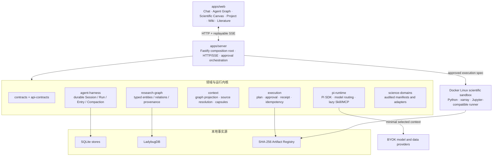

<p align="center">
  
</p>

<h1 align="center">汐灵 OS · XiLing Science Intelligence</h1>

<p align="center">
  面向广泛科学领域的本地优先人工智能科研操作系统。<br />
  将问题、文献、证据、数据、计算、审查与科研产物组织成可追踪、可审批、可复现的研究闭环。
</p>

<p align="center">
  <a href="DESIGN.md">活设计文档</a> ·
  <a href="docs/README.md">文档导航</a> ·
  <a href="docs/architecture/research-os-constitution.md">架构宪法</a> ·
  <a href="docs/testing/smoke-matrix.md">测试矩阵</a>
</p>

> 项目状态：`0.1.0-beta.1`，处于开发阶段。汐灵 OS 的产品定位是可扩展的通用科研操作系统；海洋与气候只是目前优先完成的官方领域模块，表格实验是另一项已接入的领域模块。它还不是生产级云服务，也不应被当作已经完成真实科研验证的自动科学家。

## 汐灵 OS 是什么

汐灵 OS 不是某一学科的专用分析软件，也不是给普通聊天界面附加几个科研工具。它提供跨学科共享的研究内核，把一次研究活动中的对象和决策长期保存下来，并围绕以下闭环设计：

```text
科研问题
  ↓
文献发现 → 原文阅读 → 证据摘录 → Claim / Evidence 审核
  ↓
数据探测 → 切片计划 → 用户审批 → 隔离计算
  ↓
图表 / 报告 / 数据集 / 日志 → Reviewer → Artifact 与溯源
  ↓
项目状态 → 科研画布 → Wiki → 可恢复、可复查、可复现的项目知识
```

模型负责协助理解、规划、检索和执行；系统负责保存事实、控制权限、恢复过程和展示来源。模型摘要不自动成为证据，聊天记录不替代项目数据库，画布坐标也不改变科研事实。

### 核心目标

- **研究连续性**：对话结束、页面刷新或服务重启后，项目、Agent Run、审批、证据和产物仍可恢复。
- **科学真实性**：Claim、Evidence、Dataset Snapshot、Run 和 Artifact 之间保留明确来源与版本关系。
- **可控自动化**：下载、计算和外部写入先形成可读计划，批准内容与代码、参数、输入、资源和网络策略绑定。
- **可复现执行**：科学代码在受控 Linux 容器中执行，输入和输出使用内容哈希，产物可附带 RO-Crate。
- **上下文经济**：只装配当前任务需要的图邻域、来源片段、Skill 和工具，不把整个项目、PDF 或 MCP 目录塞入模型窗口。
- **领域扩展**：科研内核不依赖某一学科，学科能力通过受审计的领域 Manifest、适配器、查看器和 Runner 环境接入。

### 明确不做什么

- 不把模型生成的内容直接视为已验证科研结论。
- 不允许 Agent 绕过审批修改正式 Claim、执行科研代码或下载大规模数据。
- 不把临时文献推荐图、Agent 运行图和科研事实图混成一个数据库。
- 不在每轮对话常驻全部 Skill 正文、MCP schema、历史消息或大型文件。
- 当前不提供云端多租户、团队权限、R/Slurm、Windows ARM 或正式签名安装包。

## 产品工作面

所有界面服务于同一个 Project，但各自只展示它负责的维度。

| 工作面 | 用户任务 | 事实来源 | 关键交互 |
| --- | --- | --- | --- |
| Chat | 提问、跟进、审批、查看当前结果 | Agent Store + 领域投影 | 流式回答、引用、Artifact、取消、恢复、模型切换 |
| Agent 运行图 | 从另一维度理解 Agent 的当前链或项目历史 | Agent Store 的有界只读投影 | Flowith 式低密度节点、沿节点继续、组合引用、详情按需展开 |
| 科研画布 | 总览项目科研事实、证据链、计算溯源和 Artifact 生命周期 | Research Graph + 独立 Layout Store | 分项视图、关系筛选、局部聚焦、自由拖动、纵向层级整理 |
| 项目 | 管理目标、事项、里程碑、实验和 Workflow | Knowledge + Workflow Store | 计划、审批、状态、失败恢复和产物入口 |
| Wiki | 像浏览百科一样快速理解整个研究项目 | 版本化 Markdown + Research Graph 引用 | 目录、双向链接、历史修订、证据与 Artifact 嵌入 |
| 文献工作台 | 搜索关系、阅读论文、标注并提升证据 | Provider Cache + 临时 Discovery Graph | Semantic Scholar/OpenAlex、阅读、标注、证据捕获 |
| 设置 | 管理模型、凭据、Skill、MCP 和系统状态 | Settings + Credentials | 任意模型 ID、原生模态、连通性测试、角色级模型分配 |

## 三类图，三种责任

汐灵刻意维护三类不同的图，避免把“Agent 做了什么”“科学上已知什么”和“搜索时发现什么”混为一谈。

| 图 | 回答的问题 | 持久化与边界 |
| --- | --- | --- |
| Agent Execution Graph | Agent 如何从用户输入走到回答、调用和子任务？ | 来自耐久 Agent Store；位于 Chat；不写 Research Graph |
| Research Graph | 哪些论文、证据、断言、数据、运行和产物构成项目的科学事实与溯源？ | LadybugDB 类型化属性图；正式科研关系的事实源 |
| Literature Discovery Graph | 哪些论文在引用、共被引或书目耦合上相关？ | 文献工作台的临时发现图；只有显式收藏、标注或证据提升才进入项目事实 |

科研画布只是 Research Graph 的交互投影。节点位置、折叠和视口保存在独立 SQLite Layout Store，移动节点不会改写科研关系。

## 系统架构

汐灵采用模块化单体：本地安装保持简单，同时用 package、port、运行时契约和存储所有权限制耦合。



### Pi 与 Agent 中枢

- Pi Runtime 提供模型调用、流式事件、工具循环、取消和会话压缩原语。
- `@xiling/pi-runtime` 是唯一允许直接依赖 Pi 的反腐层，便于升级上游而不污染业务包。
- `@xiling/agent-harness` 是 Pi 无关的耐久协调层，拥有 Session、Run、Operation、Entry、Usage、Compaction 和事件游标。
- Web 只发命令、订阅可重放事件并读取快照，不拥有 Agent 或 Workflow 写入真相。
- 多智能体只预置研究探索、领域执行、独立审查三类基础角色；子任务使用隔离 Session、内容寻址 ContextManifest 和结构化 Handoff，禁止递归委派。

### 上下文为什么天然节省

汐灵不依赖一个武断的全局 token 上限，而是从架构上减少无关信息：

1. Project、活动科研实体和显式引用先确定检索范围。
2. Research Graph 只投影确定性的有限两跳邻域，不读取整图。
3. `SourceContentResolver` 在命中后才读取 Agent Entry、证据原文、论文摘要、Wiki Revision 或 Artifact 片段。
4. 大型 PDF、NetCDF、图像和完整日志留在 Artifact Store，只将 URI、摘要和必要片段送入模型。
5. Skill 常驻内容只有索引；命中任务后才读取正文并激活关联工具。
6. MCP 常规轮次只暴露一个惰性代理，具体 Server 与工具 schema 经 search/describe 按需获取。
7. Pi Compaction 只保持会话连续性；科研事实仍由版本化领域存储拥有。
8. TokenLedger 和 Context Trace 用于观测组成、来源覆盖、缓存命中与降级，而不是掩盖信息丢失。

## 数据与持久化

| 数据 | 唯一事实源 | 关键不变量 |
| --- | --- | --- |
| Project、事项、Wiki、证据捕获 | Knowledge SQLite | 项目隔离；Wiki Revision 不可变；证据保留原文定位与局限 |
| Agent 消息与运行 | Agent SQLite | 追加式、可重放、可压缩但不删除原 Entry |
| Workflow | Workflow SQLite + durable outbox | 状态与投影事件同事务；审批绑定计划哈希 |
| 科研实体与关系 | LadybugDB Research Graph | 类型化端点、单写事务、版本关系、applied ledger |
| 画布布局 | Scientific Canvas Layout SQLite | 仅表现状态；按 project/view 隔离；revision 防覆盖 |
| Artifact | SHA-256 blob + SQLite metadata | 内容寻址、项目可见性、生命周期和来源记录 |
| 文献发现缓存 | Literature Provider Cache | 临时结果不能自动成为证据 |
| 凭据 | AES-256-GCM 加密文件 | 不回传 UI、不进入日志、Artifact 或模型上下文 |

跨 SQLite/LadybugDB 不伪装成分布式事务：源存储使用 durable outbox 或 Agent journal，Research Graph 使用 applied ledger，启动和查询前通过幂等 reconcile 收敛。

业务对象持久化 `project://`、`artifact://`、`dataset://` 等资源 URI，不持久化任意操作系统绝对路径。

### 与开放知识工具互操作

当前数据库不是 Obsidian Vault，也不会让外部编辑器直接修改科研事实源。现有 Wiki Markdown、`[[slug]]`、Research Graph 实体/关系和 Artifact URI 已具备导出为 Markdown notes 与 [JSON Canvas](https://jsoncanvas.org/) 的模型基础；正式双向集成仍应作为受控投影实现：导出可重建，外部修改导入为 proposal/revision，而不是覆盖 Claim、Evidence 或 Provenance。此项是规划中的互操作边界，不是当前已交付功能。

## 当前已实现能力

- Pi 适配、耐久 Agent Harness、可重放 SSE、取消、恢复、Compaction 与 TokenLedger。
- Chat 与低密度 Agent 运行图，包括沿节点继续、组合引用和项目全景。
- Research Graph、五类科研画布投影、类型化关系、局部上下文和独立布局恢复。
- Project Workflow、审批、Connector Job、通用 Execution Plan/Spec/Receipt 与 RO-Crate 产物。
- Wiki 不可变修订、全文搜索、双向链接和 Research Graph 引用。
- Semantic Scholar/OpenAlex 文献发现、阅读标注和结构化证据提升。
- 本地 NetCDF/GRIB/Zarr/CSV，以及 ERDDAP、Argo、Copernicus Marine、NASA Harmony 的连接器边界。
- 内容寻址 Artifact Registry 和数据/运行/审查/产物的溯源投影。
- 通用科学、海洋气候和表格实验领域模块；领域能力按项目组合，未选择的学科能力不会进入当前任务。
- 多 Provider BYOK、自定义 Provider/模型 ID、模型原生模态、连通性测试和角色级模型覆盖。
- 只读 Skill 可视化、惰性 Skill 装配，以及隔离 Pi MCP Host 与设置页配置。
- macOS、Linux、Windows 11 原生控制面和统一 Docker Linux 科研沙箱。

## 快速开始

### 环境要求

- Node.js `>=22.19.0`
- pnpm `11.19.0`（建议通过 Corepack 使用）
- Docker（运行隔离科研 Runner 时需要）
- Python 3.12（仅直接运行本地 Runner smoke 时需要）

### 开发模式

```sh
corepack enable
pnpm install
pnpm dev
```

- Web 开发服务器：<http://127.0.0.1:4318/>
- API Server：<http://127.0.0.1:4317/>

### 构建后启动

```sh
pnpm start
```

命令会构建工作区、启动 Server、等待 `/health` 通过，并打开 <http://127.0.0.1:4317/>。无桌面或 CI 环境使用：

```sh
pnpm start:no-browser
```

### Windows 11

Windows 原生运行 Node 控制面、SQLite、LadybugDB、项目和 Artifact；科学执行进入 Docker Desktop Linux 容器。汐灵不安装、管理或调用 WSL 发行版。

```powershell
.\scripts\windows\xiling-doctor.ps1
.\scripts\windows\install.ps1
.\scripts\windows\xiling-start.ps1
```

默认数据目录为 `%LOCALAPPDATA%\XiLingOS`。完整说明见[跨平台部署设计](docs/architecture/deployment.md)。

## 配置与真实调用

- 正式 Agent 调用使用真实模型路由；未配置主模型时明确失败，不以 fixture 冒充真实回答。
- 用户可填写任意模型 ID。推荐模型目录只是输入辅助，不是白名单。
- 输入/输出模态定义在模型级；不支持的原生模态在界面禁用，不做非原生转码伪装。
- 主智能体、研究探索、领域执行和独立审查可以分别选择模型。
- Provider、OpenAlex、Copernicus、NASA 等凭据在设置中管理；状态接口不返回密钥明文。
- 数据连接器的 fixture/live 是开发与测试环境边界，不是产品里的“离线回答模式”。真实网络请求仍需元数据预检和用户审批。

不要将 `.env`、凭据文件、项目数据或真实研究资料提交到 Git。

## 验证

```sh
pnpm check          # 架构、文档、Pi 兼容、类型、测试与 smoke 总门禁
pnpm architecture   # 包依赖边界 + 文档结构/链接
pnpm pi:compat      # Pi 上游兼容性和反腐层测试
pnpm typecheck      # TypeScript 类型检查
pnpm test           # 离线单元与集成测试
pnpm smoke          # 固定 fixture 的最短成功/失败路径
pnpm compliance     # 许可证与依赖完整性
pnpm sbom:generate  # 生成 SBOM 相关清单
```

容器 Runner 闭环：

```sh
docker build -t xiling-runner:dev services/runner
docker run --rm --network none xiling-runner:dev python smoke.py
```

自研模块必须覆盖启动、最短成功路径、关键失败路径、取消和资源清理。没有 Docker、真实 Windows 专机或外部凭据时，检查必须明确报告“未验收/跳过”，不能把代码存在描述为验证通过。

## 仓库结构

```text
apps/web/                   React + TypeScript 产品界面
apps/server/                Fastify 组合根、领域 API 与应用编排
packages/contracts/         领域中立核心类型
packages/api-contracts/     前后端共享运行时契约
packages/agent-harness/     耐久 Agent Session/Run/Event 中枢
packages/pi-runtime/        Pi SDK、模型路由、Skill、MCP Host 适配
packages/context/           上下文投影、来源解析、Capsule 与观测
packages/multi-agent/       角色、TaskPacket、隔离调度与 Handoff
packages/research-graph/    类型化 Research Graph 与 LadybugDB 适配
packages/artifacts/         内容寻址 Artifact Registry
packages/execution/         通用计划、审批、执行、收据与幂等
packages/science-domains/   领域 Manifest、注册和项目级组合
packages/domain-ocean/      当前优先完成的海洋与气候领域模块
packages/domain-tabular/    表格实验领域模块
packages/knowledge/         Knowledge ports、SQLite 与迁移
packages/literature/        文献 Provider、缓存与图算法
packages/connectors/        数据连接器与审批状态机
packages/credentials/       加密凭据存储
packages/platform/          跨平台路径、导入和 Windows 适配
services/runner/            Python 科学计算与 Docker Runner
scripts/                    启动、架构、smoke、合规与平台检查
docs/                       架构、ADR、质量、测试和历史 Gate
DESIGN.md                   当前有效产品与软件架构事实源
```

## 文档地图

首次参与开发建议按顺序阅读：

1. [本 README](README.md)：产品目标、能力、运行方式和边界。
2. [活设计文档](DESIGN.md)：当前架构、所有权、不变量、关键流程与风险。
3. [科研内核架构宪法](docs/architecture/research-os-constitution.md)：不得破坏的系统约束。
4. [模块化单体架构](docs/architecture/modular-monolith.md)与[领域模型](docs/architecture/domain-model.md)：模块和对象边界。
5. 按任务进入 [文档导航](docs/README.md)，阅读 Research Graph、Context、Multi-Agent、Deployment 或相关 ADR。

`docs/gate-*.md` 和 `docs/spikes/` 是历史验收与技术调查记录，不是当前架构事实源；它们与 DESIGN 冲突时，以代码公开接口、DESIGN 和未被替代的 ADR 为准。

## 开发约束

1. 优先复用许可兼容、维护活跃的开源项目；新增依赖更新 [OSS 评估矩阵](docs/oss-evaluation.md)和第三方声明。
2. 新功能先确定对象所有者、事实源、权限边界和失败恢复，再设计页面或路由。
3. 领域包不能直接依赖 Pi、数据库实现、凭据或任意执行；Server 组合根显式注册适配器。
4. 业务包不得直接依赖 Pi；Pi 升级只穿过 `@xiling/pi-runtime` 并运行 `pnpm pi:compat`。
5. 不新增第二份 Chat、Claim、Artifact、Workflow 或 Research Graph 真相源。
6. 改变模块归属、依赖方向、持久化、上下文装配或执行权限时，同一变更更新 DESIGN 和 ADR。
7. 新增自研边界必须有稳定接口、离线 fixture、冒烟测试和可替换说明。

详细规则见[贡献与文档维护说明](docs/README.md#贡献与文档维护)。

## 当前限制与发布边界

- 当前交付形态面向个人研究者；多人实时协作和云端多租户不在当前范围，但这不是学科范围限制。
- 产品内核面向通用科研；目前海洋与气候领域模块的连接器、数据切片和 Python 分析链最完整，其他领域模块仍需逐项补齐领域连接器、查看器和执行环境。
- Pi 通用 Package 安装器尚未实现；Skill 当前为受管目录，只读展示和惰性装配。
- Docker 沙箱保护科学 Runner，不应被描述为已经覆盖所有 Pi/MCP 工具的通用 OS 级沙箱。
- R、SSH/Slurm、中国受限数据源、Windows ARM、签名安装器和 WinGet 发布仍待实现。
- 真实 Windows 11 + Docker Desktop、企业代理、大文件、休眠恢复和真实科研项目验收仍是 Beta 发布门禁。

## 许可证与第三方

本仓库当前为私有开发项目；对外发布前需明确项目许可证。第三方依赖、版权与复用边界见 [THIRD_PARTY_NOTICES.md](THIRD_PARTY_NOTICES.md)、[OSS 评估矩阵](docs/oss-evaluation.md)及生成的 SBOM。
