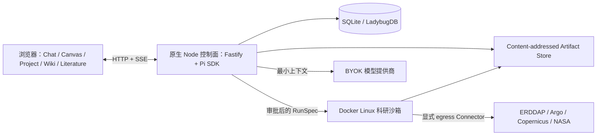
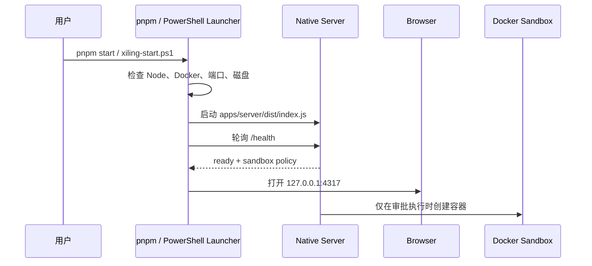

# 跨平台部署、原生 Windows 与科研沙箱

## 逻辑部署



## 平台映射

| 平台 | Web/Server 与数据库 | Runner | 默认活动数据 |
|---|---|---|---|
| macOS | 本机 Node | Docker Linux 容器 | 仓库 `data/`；打包后迁移到应用支持目录 |
| Linux | 本机 Node | Docker Linux 容器 | 仓库 `data/`；打包后迁移到 XDG 数据目录 |
| Windows 11 | 原生 Node | Docker Desktop Linux 容器 | `%LOCALAPPDATA%\XiLingOS` |

Docker Desktop 可能在内部使用 WSL2 或 Hyper-V，但这属于 Docker 的实现细节。汐灵不调用 `wsl.exe`，不创建发行版，也不把应用数据库放入 Linux 虚拟磁盘。

## 启动序列



`pnpm start` 默认在前台运行并显示日志。无桌面环境使用 `pnpm start:no-browser` 或 `XILING_NO_BROWSER=1`。PID 写入 `<dataRoot>/runtime/xiling-server.pid`；停止首先调用应用 API，只有明确的故障恢复参数才强制结束进程。

## Windows 数据目录

```text
%LOCALAPPDATA%\XiLingOS\
├── projects\       # 项目导入快照
├── artifacts\      # 用户可见 Artifact 数据
├── cache\          # 可安全重建的缓存
├── database\       # 预留的数据库目录
├── credentials\    # AES-256-GCM 密文与独立主密钥
├── logs\           # 脱敏诊断日志
├── runtime\        # PID 等可重建状态
└── workspace\      # 应用 SQLite、LadybugDB 与内容寻址对象
```

业务对象持久化资源 URI，而不是任意操作系统绝对路径。外部路径只作为导入审计元数据。

## Windows 导入

1. PowerShell 接收本地盘绝对路径。
2. 拒绝 UNC/SMB、目录、OneDrive 离线占位和 reparse point。
3. 计算 SHA-256，复制到项目导入暂存文件。
4. 原子移动为以哈希命名的只读来源快照，输出 `artifact://<sha256>`。
5. 科研 Runner 只接收受管快照，不直接挂载任意用户路径。

## Docker 沙箱不变量

- 固定非 root 用户 `10001:10001`，移除全部 Linux capabilities，并启用 `no-new-privileges`。
- 显式 CPU、内存、PID、文件句柄、IPC 和 tmpfs 限制。
- 分析默认 `--network none`；Connector 仅在任务确需公网时使用 egress 网络。
- 凭据不进入 argv、计划、日志、Artifact 或模型上下文，只经 stdin 注入单次运行。
- 容器执行完成或取消后强制清理；输出复制回 Host 后校验 manifest 与 SHA-256。
- 当前工作区需要在容器层写入，因此根文件系统尚未设为只读；这是明确记录的后续加固项。

## 安全与取消

- Server 默认绑定 `127.0.0.1`，不创建公网监听或防火墙规则。
- Pi 使用 `abort()`，下载使用 `AbortSignal`，容器先 `docker stop` 再在超时后升级清理。
- 凭据不写入项目数据库、会话、Research Graph 或 Artifact。
- Host 只负责控制面；模型生成的 Python、Shell 和官方科研客户端不得绕过 Docker 沙箱。
