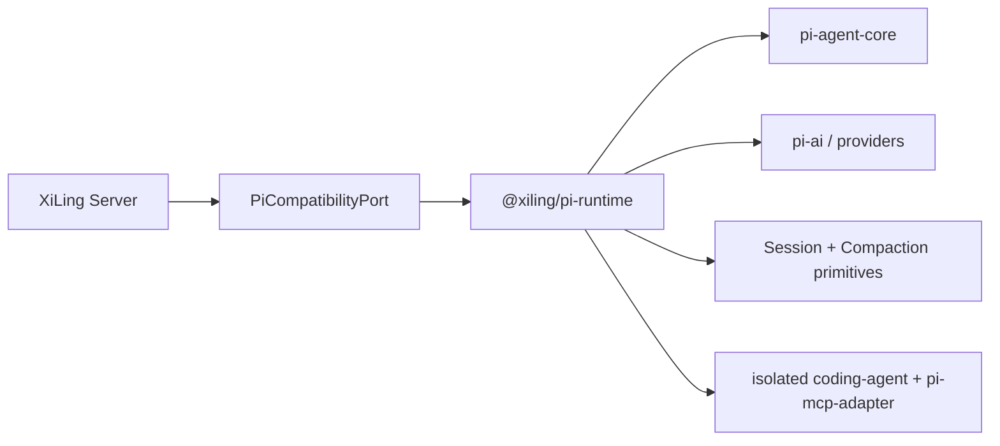

# Pi 升级与 Package 兼容架构

> 状态：兼容边界、版本门禁与隔离 MCP Host 已实现；通用 Package 安装 UI/下载器尚未实现。
> 日期：2026-08-25

## 1. 目标

汐灵嵌入的是 `@earendil-works/pi-agent-core` 与 `@earendil-works/pi-ai`，不是 Pi Coding Agent 的终端产品。兼容目标分为两层：

1. Pi 内核升级只修改 `@xiling/pi-runtime`，不扩散到 Chat、Canvas、Wiki、Evidence 或 Workflow。
2. Pi Package 可以作为资源分发格式导入，但不得绕过汐灵的项目权限、审批、容器与上下文按需加载机制。

“兼容 Pi Package”不等于在汐灵进程内无条件运行任意 Pi Coding Agent Extension。

## 2. Pi 升级边界



- `apps/*` 和其他领域包不得直接导入 `@earendil-works/pi-*`。
- Server 使用 `RuntimeHistoryMessage`、`RuntimeTool`、`RuntimeModelRoute` 和 `AgentStreamEvent`，不持有 Pi `AgentMessage`、`AgentTool`、`Model` 或 `StreamFn`。
- Pi `Agent.state` 等版本敏感访问只能存在于适配器内部。
- 正式持久化 schema 使用汐灵自己的版本化记录；Pi entry 通过 mapper 转换，不把某个 Pi JSON schema 永久当作产品数据库协议。
- `pi-agent-core`、`pi-ai` 与 MCP Host 使用的 `pi-coding-agent` 必须同版本升级；`pi-mcp-adapter` 也固定在已审计版本。

## 3. 升级门禁

兼容基线记录在 `packages/pi-runtime/pi-compatibility.json`。候选升级必须：

1. 在独立分支同时修改 core/ai/coding-agent 版本；adapter 单独精确锁定，不允许范围版本自动漂移。
2. 阅读上游 changelog，列出 Agent、Session、Compaction、Skill、provider 与 Windows 变更。
3. 明确更新兼容基线；未更新时 `pnpm pi:compat` 必须失败。
4. 运行 `pnpm pi:compat`，覆盖流式事件、工具、取消、模型路由、Skill 懒加载、JSONL Session、Compaction 和 Harness 能力探测。
5. 对 Session 格式变化生成 dry-run 报告；现有数据迁移必须备份、dual-read、可回滚。
6. 再运行 `pnpm check`、Linux/macOS/Windows hosted smoke 与真实 Windows + Docker 发布候选验收。

## 4. Pi Package 资源分级

| Pi Package 资源 | 汐灵策略 | 原因 |
|---|---|---|
| `SKILL.md` | 可直接导入受管 Skill Store | 与现有 Pi 原生 loader 和按需上下文机制兼容 |
| Prompt template | 可导入为用户显式调用模板；默认不进系统提示 | 纯文本资源，可审计且不应常驻消耗上下文 |
| Tool extension | 只通过 `ResearchExtensionAPI` 适配，在隔离进程/容器执行 | 需要权限声明、取消、输出上限和 Artifact 化 |
| Coding Agent Extension | 默认拒绝直接运行 | 依赖 `ExtensionAPI`、终端事件或完整系统权限 |
| TUI command / theme | 不兼容 | 汐灵使用 Web UI，不应加载终端 UI 代码 |
| MCP configuration | 由已实现的独立 MCP Host 管理；不从 Pi Package 或外部宿主隐式导入 | MCP 生命周期、凭据、审批和 schema 激活不属于 Package importer |

## 5. 安装流水线

未来可视化安装必须执行：

```text
选择本地/npm/git 来源
  → 拉取到隔离 staging（不执行 lifecycle scripts）
  → 解析 package.json 的 pi manifest / 约定目录
  → 展示资源、版本、许可证、哈希、依赖和权限
  → 用户确认
  → Skill/Prompt 复制到 UUID/哈希命名的受管目录
  → Tool Extension 构建隔离声明，不加载到 Server 进程
  → 原子发布 manifest
  → 刷新元数据索引；正文仍按需加载
```

强制规则：

- 安装、更新、禁用和删除都必须可审计、可回滚。
- npm/git 包固定版本或 commit；更新不静默漂移。
- 不执行 `preinstall`、`install`、`postinstall` 等 lifecycle scripts。
- 任意代码 Extension 默认拒绝；只有通过兼容声明、静态检查和隔离 smoke 后才能启用。
- 扩展不得直接读取凭据库、SQLite、任意宿主路径或其他项目；使用项目作用域 capability token。
- 工具 schema 仅在本轮命中后暴露；大结果进入 Artifact，不能常驻上下文。

## 6. `ResearchExtensionAPI` 最小能力

首版只考虑以下稳定端口：

```ts
interface ResearchExtensionAPI {
  registerTool(manifest: ResearchToolManifest, handler: IsolatedToolHandler): void;
  registerSkill(manifest: InstalledSkillManifest): void;
  readProjectResource(uri: ResourceUri, range: ByteRange): Promise<ResourceExcerpt>;
  writeArtifact(input: StagedArtifact): Promise<ArtifactUri>;
  requestApproval(request: ExtensionApprovalRequest): Promise<ApprovalDecision>;
}
```

不向扩展暴露 Fastify、SQLite connection、Pi Agent 对象、操作系统绝对路径、任意 shell 或长期凭据。

## 7. Windows

- Package Store、Node 依赖和 Skill 位于原生 Windows 应用/仓库目录；需要执行代码的扩展进入独立受控 Host 或 Docker 沙箱。
- Windows 路径只作为导入来源，经路径预检后复制到 staging。
- npm/git 网络访问遵守代理与自定义 CA 配置；失败不污染已发布版本。
- Tool Extension 的 smoke 在 Linux 容器中运行，不承诺完全原生 Windows Node Extension。

## 8. 当前能力声明

现在已经具备 Pi 版本兼容门禁、依赖隔离、原生 Skill 解析、设置页只读 Skill 清单，以及独立 `pi-mcp-adapter` Host。尚未具备通用 Pi Package 下载/安装、Prompt 管理或任意代码扩展运行。UI 在这些能力实现前不得显示“可安装任意 Pi 插件”。
